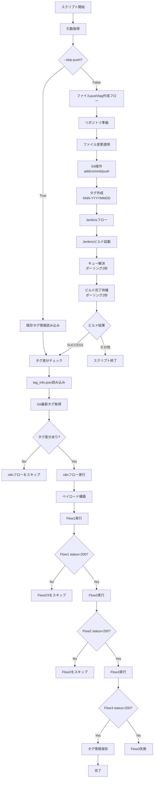

# デプロイ自動化オーケストレーター (deploy_automation.py)

## 概要

gitへのpush/tag作成、Jenkinsビルド、n8nフローを連携して自動デプロイを実行するスクリプトです。

## 処理フロー

### フロー図



### 1. 引数取得
- `--work-env` (必須): 作業環境を指定 (dv0, dv1, itb, uat, pda, pdb)
- `--skip-push` (デフォルト: True): ファイルpush/tag作成をスキップ
- `--no-skip-push`: ファイルpush/tag作成を実行
- `--index-name-short` (必須): インデックス名の短縮名を指定

### 2. ファイルpush/tag作成フロー (オプション)

#### 2.1 リポジトリの準備
- ローカルリポジトリの存在確認
- 存在しない場合はクローン
- 存在する場合は最新化（ローカル変更は保持）

#### 2.2 ファイル変更の適用
- `apply_file_changes()`: ダミー処理（ファイル追加削除を実装可能）

#### 2.3 Git操作
- ブランチの切り替え
- プロキシ設定の適用
- 変更のステージング (`git add -A`)
- コミット (`git commit`)
- プッシュ (`git push`)

#### 2.4 タグ作成
- GitLab APIから既存タグの最大シーケンス番号を取得
- `initial-tag`は無視
- 次のタグ名を生成 (`NNN-YYYYMMDD`形式)
- タグを作成

### 3. タグ差分チェック

#### 3.1 タグ情報の比較
- `tag_info.json`から保存済みタグ情報を読み込み
- Git上の最新タグと比較
- 差分がない場合は後続処理をスキップ

### 4. Jenkinsフロー

#### 4.1 ビルドのトリガー
- `buildWithParameters`でJenkinsビルドを起動
- 認証: `auth=(JENKINS_USER, JENKINS_TOKEN)`
- パラメータ: NEW_TAG, OLD_TAG, GIT_USER, GIT_TOKEN, WORK_ENV

#### 4.2 キュー解決
- ビルドキューからビルドURLを解決
- ポーリング間隔: 2秒
- タイムアウト: 5分

#### 4.3 ビルド完了待機
- ビルド結果をポーリング
- ポーリング間隔: 2秒
- タイムアウト: 30分
- 成功条件: SUCCESS または UNSTABLE

### 5. n8nフロー

#### 5.1 ペイロードの構築
- タグ番号の抽出 (例: "008-20250117" → "008")
- タグ日付の抽出 (例: "008-20250117" → "20250117")
- gitUserに@gmail.comを追加
- パラメータ: newTag, oldTag, newTagDate, oldTagDate, gitUser, gitToken, workEnv, indexNameShort

#### 5.2 フロー実行
- **Flow1**: 実行してstatusが200以外の場合は後続をスキップ
- **Flow2**: 実行してstatusが200以外の場合は後続をスキップ
- **Flow3**: 実行してstatusが200の場合はタグ情報を保存して終了

## 環境変数

### Jenkins設定
- `JENKINS_BASE`: JenkinsのベースURL
- `JENKINS_JOB`: ジョブパス
- `JENKINS_USER`: Jenkinsユーザー名
- `JENKINS_TOKEN`: Jenkinsトークン
- `VERIFY_SSL`: SSL証明書検証 (デフォルト: true)

### Git設定
- `REPO_URL`: GitリポジトリURL
- `PROJECT_ID`: GitLabプロジェクトID
- `GIT_TOKEN`: GitLabトークン
- `API_BASE`: GitLab APIベースURL
- `BRANCH`: ブランチ名 (デフォルト: main)
- `WORKDIR`: 作業ディレクトリ
- `TARGET_PATH`: 対象パス (デフォルト: .)
- `COMMIT_MESSAGE`: コミットメッセージ
- `TIMEZONE`: タイムゾーン (デフォルト: Asia/Tokyo)
- `TAG_MESSAGE`: タグメッセージ

### プロキシ設定
- `HTTP_PROXY`: HTTPプロキシ
- `HTTPS_PROXY`: HTTPSプロキシ

### n8n設定
- `N8N_FLOW1_URL`: Flow1のWebhook URL
- `N8N_FLOW2_URL`: Flow2のWebhook URL
- `N8N_FLOW3_URL`: Flow3のWebhook URL
- `N8N_SEND_JSON`: データの送信形式。デフォルトfalse

## ファイル

### 入力ファイル
- `tag_info.json`: タグ情報の保存ファイル

### 出力ファイル
- `tag_info.json`: タグ情報の更新

## エラーハンドリング

### タイムアウト
- キュー解決: 5分
- ビルド完了: 30分

### エラー時の動作
- push/tag作成エラー: スクリプト終了
- Jenkinsエラー: スクリプト終了
- n8nエラー: 該当フロー以降をスキップ

## 使用例

### 基本実行（push/tag作成をスキップ）
```bash
python deploy_automation.py -e dv0 -i test-index
```

### push/tag作成も実行
```bash
python deploy_automation.py -e dv0 -i test-index --no-skip-push
```

## 注意事項

1. **初回実行時**: `tag_info.json`が存在しない場合は初回実行として処理
2. **タグ形式**: `NNN-YYYYMMDD`形式（例: 008-20250117）
3. **initial-tag**: 新規リポジトリの初期タグは無視
4. **ローカル変更**: リポジトリ更新時にローカル変更は保持
5. **プロキシ**: 一部機能実行にプロキシ設定が必要
6. **認証**: Jenkinsとn8nの認証情報が必要
7. **hosts**: n8nのアドレスをhostsファイルに記載する必要あり
